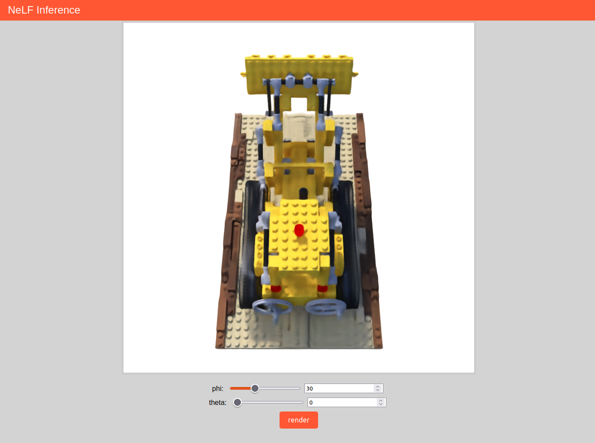
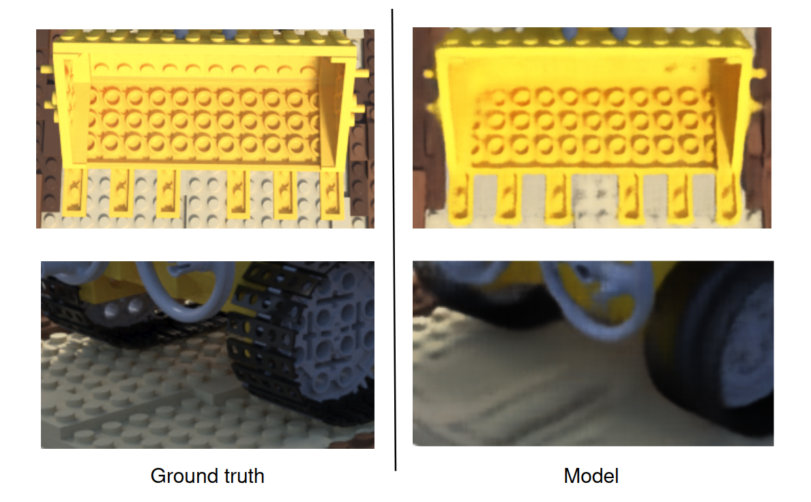

# NeRF fun

Check it out on [GitHub pages](https://rziga.github.io/nerf/).

## Idea

I wanted to run NeRF-like model in a browser.
Unfortunately, I was young and stupid back when I got this idea and had no clue how hard that is.
I was only focused on the fact that the MLP inside a NeRF is really simple, disregarding the fact that it needs to be queried an insane amount of times for each frame.
NeRFs do not run well even in native GPU environments, even less so in a browser.
I still continued on and implemented a similar class of model - NeLF.
The inference runs entirely in browser, so I don't need a server for it. 

## Results

The model reaches lower performance than the original MobileR2L, likely due to the fact that it was trained for far less time.

The results are somewhat good in high contrast areas, but not so much in lower contrast ones.

## Running the code

If you only want to play with the model, I suggest you try it [here](https://rziga.github.io/nerf/).

If you want to run the actual training, the process is a lot more involved.
You first need to generate artificial data with a NeRF model.
Due to the lack of time this is not included in this repo.
I used the one from the original [MobileR2L repository](https://github.com/snap-research/MobileR2L).
I suggest you read how to do so there.

Once you set up the environment for that, you also need to change a code a bit.
Because the authors saved images as `.npz` the storage consumption is insane, so I had to revert it to saving PNG images.

Change the `predict` method in `MobileR2L/model/teacher/ngp_pl/train.py` as follows.
1) Comment out line [245](https://github.com/snap-research/MobileR2L/blob/4f8929e8a1dcde14bd26565a2522e52c31c714f7/model/teacher/ngp_pl/train.py#L245) to disable `.npz` saving.
2) Change 100 in line [250](https://github.com/snap-research/MobileR2L/blob/4f8929e8a1dcde14bd26565a2522e52c31c714f7/model/teacher/ngp_pl/train.py#L250) to a large number, say 10,000 if you want to generate 10,000 images.

Follow the instructions in MobileR2L repo to generate the data.

Once you have the data, running this repo is pretty easy.
Move to `src/py` directory, install the `requirements.txt` with `pip` and run `train.py` with the correct arguments.
To get info about the arguments, run `python train.py --help`.

**Beware** current setup runs for around a day and requires at least 32GB of GPU VRAM.
If you have less than that, consider lowering the batch size with `--batch size {desired number}` argument.

## Repo structure

`assets` contains images for this README.

`data` is a placeholder for dataset files.

`checkpoints` is a placeholder for checkpoint files.

`sandbox` contains code but it was used for messing about.

`src` contains the actual code.

## TODOs

1) Make the model run on GPU - currently some op messes up the computation on gpu backends - need figure out why. 

2) Reimplement the teacher so the repo is self contained.

3) ...

